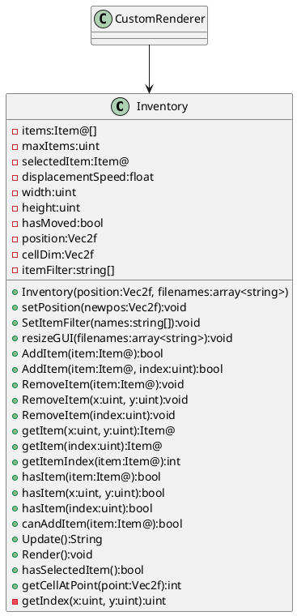

# CONTROLS :
- To enter blueprint editing mode, press Left control or Right control
- To hide blueprints, simply press 'H'
- When in editing mode, you can left click to add a block, or right click to remove a block
- When playing as a builder, use the usual menu to choose which block to place
- When playing as archer or knight, use the key 'R' and 'U' to naviguate between the different blocks
- You can select a zone by settings selection points using the 'I' and 'P' key. Use 'I' to set the first point and 'P' to set the second point. Then press 'O' to save your selection. You can also use the mouse-wheel click button.
- You can save a blueprint that is inside the two selection points using the 'O' key
- You can load your saved blueprints by using the 'L' key or using the 'X' key
- You can cycle through rendering window size by pressing 'J', try it if your performance aren't great
- You can cycle through rendering relative to your camera or your cursor by pressing 'K'
##### Thanks to all kag's modder who answered my questions and big thanks to Numan and Monkey_Feats.
##### Thanks to Epsilon for the inventory code

# INSTALLATION FOR SERVER ONLY
add the CustomRenderer.as to your rules.cfg scripts list. Example, to have it added on CTF gamemode, go to King Arthur's Gold\Base\Rules\CTF\gamemode.cfg and edit the file to add CustomRenderer.as in the script section.

## TODO:
- fix save and load to include rotation
- make it possible to flip on y axis a blueprints
- make chat command to disable live editing
- make chat command to clear all blueprints
- make a way to destroy saved blueprints
- make editing mode toggleable instead of having to hold
- make blob stock attacking when in edit mode
- make spectator camera stop moving with mouse when editing
- Make the data being sent only to the right team
    - make the 48 64 196 205 block index value go to 1 2 4 5 
- Wait for engine fix for your save system to completely work
- Optimisation : Make the inventory GUI part of a mesh and maybe use only 1 render function.
- Optimisation : Create multiple vertex array as chunk and render only the chunk near the camera.
- remove block once it's placed
- f1 tips
- dynamics notes/implement the ping mod
- cleanup code, remove the global variable
- veracity : block on flag shouldn't be allowed 
- optimise even more blueprint data sharing
    - getLocalPlayer().getNetworkID() == netID this may not work as you think it does : even when netid != localnetid, code is being executed.

## Code structure
